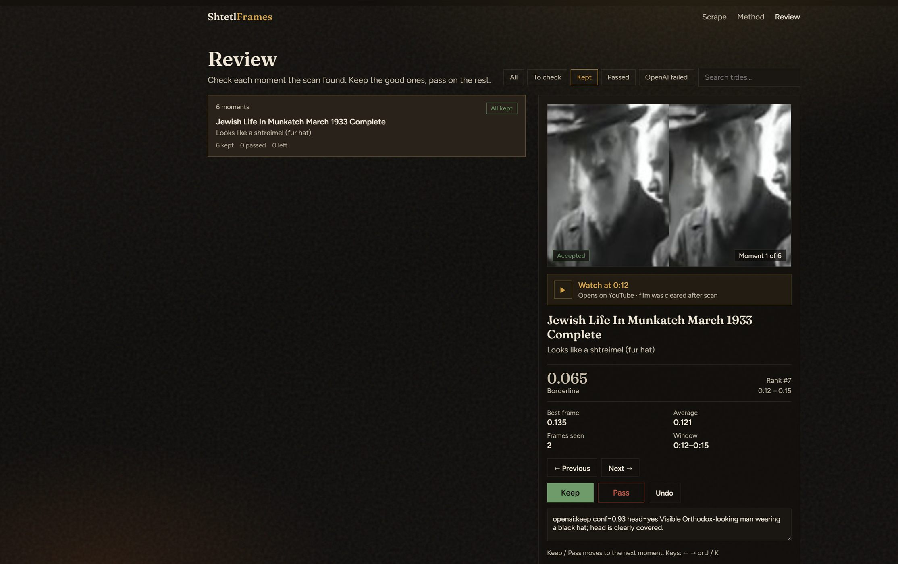

# ShtetlFrames

Local research UI that finds moments in **public archival / YouTube / British Pathé** video that *look like* traditional Orthodox Jewish men’s dress (Hasidic & Litvish), then lets a human **Keep** or **Pass** each still. Built for archivists and researchers who need a visual sieve — not facial recognition or identity claims.

> Hits are **visual candidates only**. A person must review every Keep.

---

## Quick demo



| Page | URL |
|------|-----|
| Discover / scrape | http://127.0.0.1:8787/ |
| British Pathé | http://127.0.0.1:8787/pathe |
| Review | http://127.0.0.1:8787/review |

---

## Features

- Discover videos from YouTube, playlists, channels, Archive.org, Wikimedia, and **British Pathé** listings
- Cloud GPU scrape via **RunPod** (no local NVIDIA / Docker required for the default path)
- YOLO person detect + OpenCLIP dress scoring + optional **OpenAI vision** second pass
- Review workspace: stills, timestamps, source links → Keep / Pass
- YouTube anti-bot helpers: browser cookies, HAR upload, Scrapfly / ScrapingDog proxies
- Settings UI that syncs into `.env` + SQLite

---

## Tech stack

| Layer | Tech |
|-------|------|
| Local app | Python 3.10+, FastAPI-style static+JSON server (`src/serve.py`) |
| UI | HTML / JS (`web/`) |
| Queue / state | SQLite (`output/shtetlframes.db`) |
| GPU worker | RunPod pod, PyTorch, YOLOv8, OpenCLIP ViT-L/14, FastAPI/uvicorn |
| Download | yt-dlp (on the pod) |
| Optional AI gate | OpenAI vision (`gpt-5.4-mini` default) |
| Proxies | Scrapfly, ScrapingDog |

Deep dives: [docs/RUNPOD.md](docs/RUNPOD.md) · [docs/TECHNICAL.md](docs/TECHNICAL.md) · [docs/ARCHITECTURE.md](docs/ARCHITECTURE.md)

---

## Getting started

**Requirements:** Windows or macOS/Linux, Python 3.10+, a [RunPod](https://www.runpod.io/) API key. OpenAI + Scrapfly (and optional ScrapingDog) recommended for YouTube / Pathé.

### Windows (usual path)

```powershell
git clone https://github.com/AIQAEngineer/ShtetlFrames.git
cd ShtetlFrames

python -m venv .venv
.\.venv\Scripts\Activate.ps1
python -m pip install -U pip
pip install -r requirements.txt

copy .env.example .env
# Edit .env — at least RUNPOD_API_KEY=...

.\start_web.bat
```

Open http://127.0.0.1:8787/

### macOS / Linux

```bash
git clone https://github.com/AIQAEngineer/ShtetlFrames.git
cd ShtetlFrames

python3 -m venv .venv
source .venv/bin/activate
python -m pip install -U pip
pip install -r requirements.txt

cp .env.example .env
# Edit .env — at least RUNPOD_API_KEY=...

PYTHONPATH=src .venv/bin/python src/serve.py
```

Open http://127.0.0.1:8787/

You can also paste keys later in the in-app **Settings** panel (UI values win over `.env` for the same key).

---

## Environment variables

Do not commit secrets. Copy from `.env.example`.

| Variable | Required | Purpose |
| -------- | -------: | ------- |
| `RUNPOD_API_KEY` | Yes | Create / drive cloud GPU pods |
| `SCAN_BACKEND` | No | `runpod` (default) or `local` |
| `RUNPOD_GPU_TYPE` | No | Preferred GPU (default `NVIDIA GeForce RTX 3090`; cheaper first, falls back if busy) |
| `RUNPOD_MAX_INFLIGHT` | No | Scrape GPU pods, **1–8** (default `8`); Pathé +1 discover (hard cap 9) |
| `RUNPOD_STOP_WHEN_DONE` | No | `1` = stop pods after scrape (saves money) |
| `RUNPOD_JOB_TIMEOUT_SEC` | No | Per-video timeout (default `1800`) |
| `SCORE_THRESHOLD` | No | CLIP gate before vision verify (default `0.04`) |
| `VERIFY_BACKEND` | No | `ollama_then_openai` (default: Ollama first, OpenAI on keeps), `openai`, or `open_vlm` |
| `OPEN_VLM_BASE_URL` | If open_vlm | `pod` = Ollama on RunPod GPU (default); or remote OpenAI-compatible URL |
| `OPEN_VLM_MODEL` | No | Default `qwen2.5vl:3b` (faster on-pod Ollama) |
| `OPENAI_API_KEY` | No | Vision second pass before Review |
| `OPENAI_VERIFY` | No | `1` = only vision-approved stills in Review |
| `OPENAI_MODEL` | No | Vision model (default `gpt-5.4-mini`) |
| `PROXY_PROVIDER` | No | `auto` \| `scrapfly` \| `scrapingdog` \| `none` |
| `SCRAPFLY_API_KEY` | No | YouTube proxy + British Pathé HTML scrape |
| `SCRAPINGDOG_API_KEY` | No | YouTube proxy fallback when Scrapfly is busy/unset |
| `YT_COOKIES_BROWSER` | No | Cookie export browser (`edge` default) |

Full list and notes: `.env.example`.

---

## How to use

### Main loop (YouTube / Archive)

1. Open http://127.0.0.1:8787/
2. **Settings** → paste **RunPod API key** (optional: OpenAI, Scrapfly/ScrapingDog).
3. Paste a **small** public URL (one video or short playlist) → **Discover**.
4. **Start scrape** → wait for stills (first pod boot can take 5–15 minutes).
5. Open **Review** → **Keep** / **Pass**.

### British Pathé

1. Open http://127.0.0.1:8787/pathe
2. Discover listing pages (needs Scrapfly for HTML).
3. Scrape uses free Pathé HLS on the GPU (not the YouTube proxy path).
4. Review stills the same way.

### Quick smoke test (Munkács 1933)

```powershell
$env:PYTHONPATH = (Resolve-Path .\src).Path
.\.venv\Scripts\python.exe scripts\demo_munkacs_runpod.py
```

Writes `output/munkacs_runpod_demo.json` and stops the pod when done.

### If YouTube blocks downloads

1. Sign into YouTube in **Edge**, retry.
2. Or: DevTools → Network → reload → *Save all as HAR* → Settings → **Upload HAR cookies**.
3. Or: set Scrapfly / ScrapingDog in Settings.

### Ethics (short)

- Automatic hits ≠ identity and ≠ “this person is a rabbi.”
- Prefer clearly licensed / public-domain sources; respect platform terms.
- Only human **Keep** should feed any curated list.

---

## Testing

```powershell
# Windows
.\.venv\Scripts\Activate.ps1
$env:PYTHONPATH = (Resolve-Path .\src).Path
pytest -q
```

```bash
# macOS / Linux
source .venv/bin/activate
PYTHONPATH=src pytest -q
```

Tests live under `tests/` (crawl, Pathé helpers, scoring clamps, proxy / HAR, etc.). There is no Playwright suite yet.

---

## Project structure

```text
start_web.bat          Start local UI (Windows)
requirements.txt       Local Python deps
.env.example           Env template (no secrets)

web/                   Browser UI (home, Pathé, Review)
src/                   Local orchestrator + APIs
  serve.py             HTTP server (:8787)
  pipeline_*.py        Discover / scrape jobs
  runpod_*.py          Pod provision + client
  shtetl_core/         Shared YOLO + CLIP logic
  britishpathe.py      Pathé discover / resolve
runpod_worker/         Code pods pull from GitHub on boot
tests/                 pytest
docs/                  Architecture, RunPod API, screenshots
scripts/               One-off demos (e.g. Munkács)
output/                SQLite DB + exports (gitignored)
data/                  Temp cookies / downloads (gitignored)
```

Pods fetch worker files from GitHub `main` on boot (`WORKER_COMMIT` in `src/runpod_bootstrap.py`). Push worker changes before recreating pods.

---

## Contributing

1. Fork / branch from `main`. Prefer names like `fix/…`, `feat/…`, `docs/…`.
2. Keep PRs focused; don’t commit `.env`, API keys, `output/`, weights, or large logs.
3. Match existing style (Python + small static UI). No formatter mandate beyond “looks like the neighbors.”
4. Before opening a PR:
   - `pytest -q` passes
   - smoke the UI path you touched (Discover → Scrape → Review, or Pathé)
5. Describe **why** in the PR body; link issues if any.
6. Pod behavior: if you change `runpod_worker/` or `src/shtetl_core/`, note that pods must be recreated (or wait for a fresh bootstrap) to pick up `main`.

---

## Known issues / roadmap

**Known**

- First pod boot installs deps — often **5–15 minutes**; 404/502 during that window is normal.
- YouTube bot-checks are flaky; cookies + residential proxy are often required.
- Pathé discover needs Scrapfly; oversubscribing one GPU with many Pathé jobs causes proxy 503/524 (cap is one job per pod).
- `RUNPOD_MAX_INFLIGHT` / UI workers on RunPod are hard-capped at **8 pods**.
- No formal LICENSE file in the repo yet.
- Local GPU (`SCAN_BACKEND=local`) needs your own CUDA stack; RunPod is the supported default.

**Roadmap (honest, not promised)**

- Clearer pod status in the UI while the pool fills to 4
- Stronger Pathé title / queue polish
- LICENSE + contribution templates
- Optional cheaper default GPU / cost tips in Settings

---

## License / contact

**License:** not specified in-repo yet — treat as source-available research software until a `LICENSE` is added. Ask before commercial use.

**Contact / issues:** [github.com/AIQAEngineer/ShtetlFrames](https://github.com/AIQAEngineer/ShtetlFrames) — open an issue for bugs and questions.

Maintainer: [@AIQAEngineer](https://github.com/AIQAEngineer)
